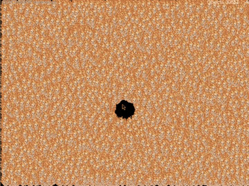

<h1 align="center">Fire Skeleton Invader</h1>

<p align="center">
  
</p>

<p align="center">
  <i>A hand-written 2D game engine in pure C — a custom ECS for speed, a Lua layer for gameplay — with a benchmark to prove it scales.</i>
</p>

<p align="center">
  
  <br>
  <sub>The benchmark at full tilt — tens of thousands of sprites, each independently simulated and rendered, repelled by the cursor.</sub>
</p>

---

An educational project written in **C11**, built to design and stress-test a
custom **Entity Component System (ECS)** from scratch. The engine, every data
structure it relies on, the worker pool and the logger are all hand-written,
with no third-party code beyond the windowing/UI libraries.

The hot path — simulating and rendering tens of thousands of entities — stays in
C, while **game logic is written in Lua**. The main menu offers two modes, both
driven by Lua scripts on top of the same engine:

- **PLAY** — a small but complete **Space Invaders** clone.
- **BENCHMARK** — an adaptive ECS stress test.

The interface (menus, HUD) is built with **Clay**, an immediate-mode layout
library.

> Status: a playable demo and a stress benchmark, both scripted in Lua. The
> focus is the architecture and how far it scales. Learning sandbox / WIP.

## Results

On a release build (`-O3 -march=native -flto`) the engine sustains roughly
**41,700 independently-simulated and individually-rendered sprites at 30 FPS** —
each with its own motion, edge bouncing, and repulsion from the mouse cursor.
And that's on a modest **Asus Vivobook laptop running Arch Linux**, not a
workstation.

- **~41,700** sprites @ 30 FPS — release build (modest Asus Vivobook, Arch Linux)
- **~16,500** sprites @ 30 FPS — debug build (with AddressSanitizer)
- Dense component storage alone took the ceiling from **~7,400 → ~16,500**
- Clean under **AddressSanitizer + LeakSanitizer** — no leaks, no memory errors

## Tech stack

| Area | Technology |
|------|------------|
| Language | C11 |
| Game-logic scripting | [Lua 5.4](https://www.lua.org/) |
| Windowing / input / rendering | [SDL3](https://www.libsdl.org/) |
| Textures | SDL3_image |
| Text / fonts | SDL3_ttf ([Liberation Sans](https://github.com/liberationfonts/liberation-fonts), SIL OFL) |
| Compression | zlib |
| UI layout | [Clay](https://github.com/nicbarker/clay) (vendored as `src/clay.h`) |
| Concurrency | POSIX threads |
| Build | GNU Make + GCC (native), Emscripten (web, WIP) |
| Debugging | AddressSanitizer + LeakSanitizer |

The ECS, its containers, the worker pool and the logger are written from scratch
with no third-party dependencies.

## Architecture

A from-scratch ECS, with its design inspired by
[sturnclaw/ecs-c](https://github.com/sturnclaw/ecs-c):

- **Entities** are lightweight integer ids.
- **Components** are plain data (`Transform`, `Velocity`, `Sprite`).
- **Systems** hold update logic (`VelocitySystem`, `SpriteRenderSystem`),
  operate on entities matching an **archetype**, and declare ordering
  dependencies.
- The scheduler respects those dependencies and runs thread-safe systems across
  a worker pool, keeping renderer-touching systems on the main thread.

It is backed by purpose-built containers (`src/ecs_*.c`): hashtables, a **dense
sparse-set component pool** (contiguous data, O(1) lookups), dynamic arrays, a
memory pool, and a **barrier-based thread pool**.

The game layer is a classic `events → update → render` loop with scene
management (menu, options, level); Clay builds the UI each frame and an SDL3
backend (`src/clay_renderer.c`) draws it.

## Game logic & scripting (Lua)

Game logic lives in **Lua** (`scripts/`), embedded via a single main-thread
state (`src/script.c`). The guiding rule is **script the rules, not the inner
loop**: the heavy per-frame work — moving and rendering every entity — stays in
C systems, while Lua drives the sparse, high-level decisions (spawning, waves,
events, scoring). Lua is only ever called a handful of times per frame, never
once-per-entity, so the throughput the engine is built for is preserved. Both
the Space Invaders demo and the benchmark are *entirely* Lua scripts.

Scripts get a small C API and a few callbacks:

```lua
-- a prefab is a named template -> registers an ECS archetype under the hood
prefab "Invader" {
  Transform = { w = 48, h = 48 },
  Sprite    = { image = "skeleton" },
  Collision = {},                  -- opt in to collision detection
}

function on_start()                -- scene setup
  start(wave)                      -- run a coroutine-based "director"
end

function wave()                    -- reads top-to-bottom; wait() yields
  for i = 1, 5 do spawn_at("Invader", 100 * i, -20); wait(0.5) end
end

function on_update(dt) ... end     -- once per frame (not per entity)
function on_key(key)  ... end      -- "left"/"right"/"space"/...
function on_collision(a, b) ... end -- C spatial-hash broad-phase calls back here
```

Exposed to Lua: `prefab`, `spawn` / `spawn_at` / `spawn_many` / `destroy` /
`despawn` / `count`, `set_pos` / `get_pos`, `key_down`, `fps`, `hud`, the
coroutine helpers `start` / `wait`, and `SCREEN_W` / `SCREEN_H`. Collisions use
a uniform **spatial hash** over an opt-in `CollisionComponent`, so the
benchmark's bouncing sprites (which lack it) cost nothing.

**Hot reload:** the active script's file is watched, and on change a fresh Lua
state is built and swapped in *only if it loads cleanly* — a syntax error leaves
the running game untouched. Edit a `.lua`, save, and the scene rebuilds with no
recompile.

## Benchmark

Selecting **BENCHMARK** runs an interactive ECS stress benchmark
(`scripts/benchmark.lua`):

1. Starts with a single bouncing sprite (very high FPS).
2. Spawns more entities at a steady, frame-spread rate.
3. When the smoothed frame rate hits the 30 FPS floor, it records the **peak
   entity count** sustained.
4. Despawns back to the base count, pauses briefly, then loops.

Sprites are repelled from a circle around the mouse cursor, so the load is
interactive. The HUD shows the live object count, FPS, and benchmark phase/peak,
letting you watch in real time how many independently-simulated, individually-
rendered sprites the architecture sustains.

## Optimization work

The project started from a non-building state. It was first made to build and
run cleanly — every change validated against an AddressSanitizer / LeakSanitizer
build that must stay free of memory errors and leaks — and then profiled and
optimized.

The guiding principle was to **measure before optimizing**, and the benchmark
was the main tool. Getting it to measure the *right thing* mattered as much as
the code: an early version spawned entities in large per-frame bursts, so it was
really measuring spawn cost rather than steady-state simulation, and masked the
true bottleneck. Spreading spawns evenly across frames and averaging the frame
rate over a sliding window made the numbers honest.

With a trustworthy benchmark, targeted A/B measurements (toggling rendering and
the ECS update on/off) located the real cost. It was **not** rendering and
**not** the update arithmetic, but **how component data was reached**: components
lived in per-type hashtables, so every hot-loop access paid hashing and
pointer-chasing with poor cache behavior. Moving component data inline and then
replacing the hashtables with a **dense sparse-set** — contiguous arrays with
O(1) array-indexed lookups — was the decisive change, more than doubling
throughput.

Beyond storage: removing redundant work from the per-entity update path, caching
values recomputed every frame, and a worker pool for parallel system updates.
The repeated lesson — parallelizing or batching only helps where the real
bottleneck is — is why the benchmark, not intuition, drove every decision.

## Building & running

Two builds from the same sources: native Linux/GCC, and an experimental
WebAssembly build via Emscripten.

### Native (Linux + GCC)

Requires `gcc`, `make`, `pkg-config` and dev packages for SDL3, SDL3_image,
SDL3_ttf, zlib and Lua 5.4.

```sh
make            # optimized release build -> ./game
make debug      # AddressSanitizer + LeakSanitizer build
make run        # build and run
make clean
```

**Controls:** the mouse navigates the menu. In **PLAY**: **← / →** to move,
**Space** to shoot. In **BENCHMARK**: move the mouse to repel sprites. **Q /
Esc** returns to the menu; **E** toggles the Clay debug overlay (debug builds).

### WebAssembly (Emscripten) — experimental / WIP

> ⚠️ **Unfinished.** The wasm target *compiles and links*, but the web build is
> not yet verified to run correctly in a browser — more work is needed (canvas/
> WebGL setup, input mapping, asset paths, and rethinking the benchmark, since
> browser frames are capped at the display refresh rate). Treat it as a starting
> point, not a finished feature.

Requires the [Emscripten SDK](https://emscripten.org/) (`emcc`) and an
Emscripten-built SDL3 stack (SDL3 + SDL3_image + SDL3_ttf compiled for wasm).
Place it in `vendor/sdl3-wasm/` (prebuilt libs are not committed — large and
tied to specific versions), then:

```sh
make web                                 # uses vendor/sdl3-wasm by default
make web SDL3_WASM=/path/to/sdl3-stack   # or point elsewhere
python3 -m http.server --directory web   # serve web/game.html
```

The web build runs single-threaded (browser threads need SharedArrayBuffer /
COOP-COEP), is driven by `requestAnimationFrame`, and bundles assets into
`game.data`.

## By the numbers

- ~**7,400** lines of hand-written C across **71 files**, plus ~**290** lines of
  Lua game logic
- ~**40%** of the C is the engine itself — the ECS plus its data structures
  (~2,500 lines: core, hashtables/arrays, the dense component pool, the thread
  pool)
- The Lua bridge + spatial-hash collision add ~**940** lines of C
- The rest: rendering, UI integration, and infrastructure
- Third-party `clay.h` (~4,500 lines) is vendored and not counted above

## Project layout

```
src/
  game.c / main.c           game loop, lifecycle, scenes
  init_*.c                  SDL, Clay and ECS initialization
  ecs*.c                    ECS API, manager, storage, containers, worker pool
  components.c / systems.c  game components and systems
  script.c                  Lua scripting layer (API, prefabs, hot reload)
  collision.c               spatial-hash collision broad-phase
  ui.c / clay_renderer.c    Clay UI and its SDL3 backend
  logger.c                  leveled logger
  clay.h                    vendored Clay library
scripts/
  invaders.lua              Space Invaders demo (PLAY)
  benchmark.lua             adaptive ECS stress benchmark (BENCHMARK)
```

## Acknowledgements

- [**sturnclaw/ecs-c**](https://github.com/sturnclaw/ecs-c) — inspiration and
  reference for the ECS architecture.
- [**nicbarker/clay**](https://github.com/nicbarker/clay) — the immediate-mode
  UI layout library used for menus and the HUD (vendored as `src/clay.h`).
- [**Lua**](https://www.lua.org/) — the embedded scripting language for game
  logic.
- [**Liberation Sans**](https://github.com/liberationfonts/liberation-fonts) — a
  free (SIL OFL) Helvetica/Arial-metric font with Cyrillic coverage, bundled
  under `assets/fonts/` (see its `LICENSE`).

## License

Released under the [MIT License](LICENSE) — a permissive license compatible with
the dependencies (Clay is zlib-licensed; SDL3 is zlib-licensed). `src/clay.h`
remains under its own license.
